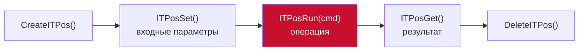
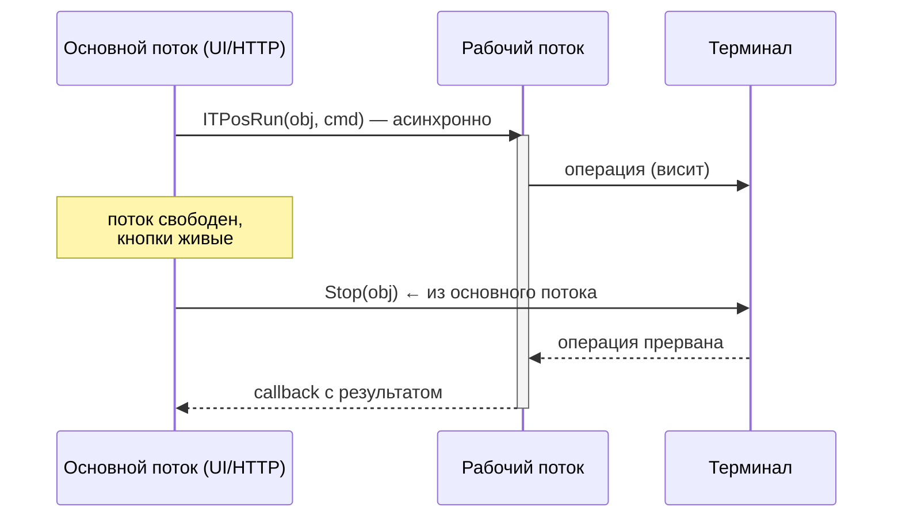
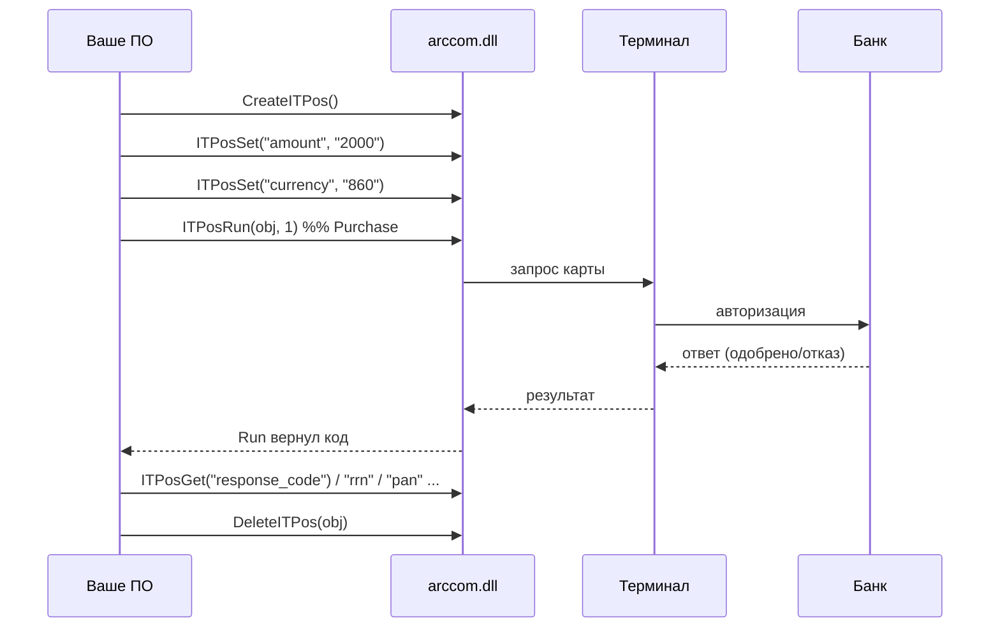
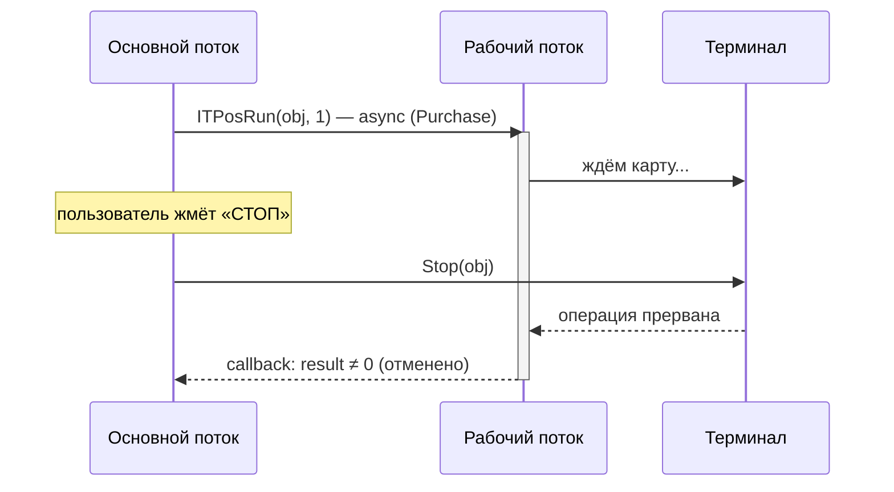
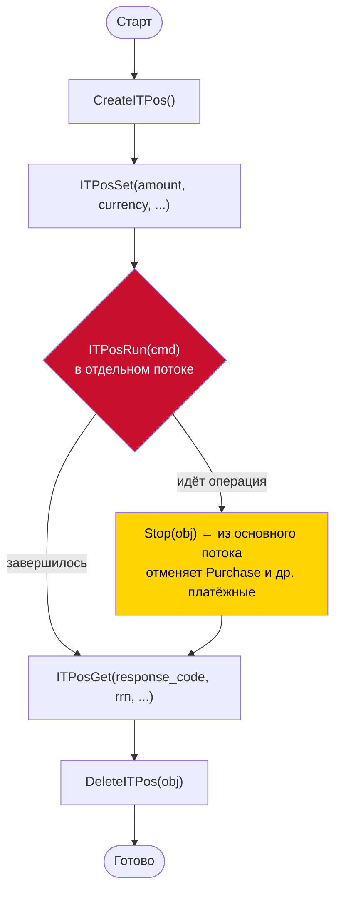

# 🧩 ARCUS 2 — практическое руководство по интеграции

> Библиотека **ARCUS 2 / 2.1** (Ingenico / Inpas, «Arcom Universal EMV POS») — это
> связующее звено между вашим ПО и платёжным терминалом. Вы вызываете несколько
> функций из нативной библиотеки `arccom.dll` (Windows) / `libarccom.so` (Linux),
> а она берёт на себя диалог с терминалом и банковским хостом.
>
> Этот документ — выжимка из официальной доки + проверенные на практике нюансы.

---

## 📑 Содержание

1. [Как начать писать интеграцию](#1-как-начать-писать-интеграцию)
2. [Что и как: основные моменты](#2-что-и-как-основные-моменты)
3. [Пример работы Purchase](#3-пример-работы-purchase)
4. [Пример работы Stop](#4-пример-работы-stop)
5. [Шпаргалка](#-шпаргалка)

---

## 1. Как начать писать интеграцию

### 1.1 Общая картина

ARCUS работает в **«режиме работы с кассой»**: терминал физически подключён к
машине (USB / RS232 / Ethernet) и ждёт команд от вашего ПО. Ваше приложение
загружает библиотеку и общается с терминалом через её функции.


> ⚠️ **Главное:** код, вызывающий `arccom.dll`, обязан выполняться **на той же
> машине**, где стоит библиотека и подключён терминал. Загрузить Windows-DLL с
> другого хоста (даже по сети) нельзя. Если нужен доступ с другого устройства —
> поднимайте на машине с терминалом HTTP/сервис и ходите по сети к нему.

### 1.2 Что понадобится

| Что | Детали |
|-----|--------|
| **Библиотека** | `arccom.dll` (Windows) или `libarccom.so` (Linux), обычно в `C:\Arcus2\DLL\` |
| **Зависимые DLL** | держите их рядом с `arccom.dll` и добавляйте папку в `PATH` |
| **Разрядность** | ⚠️ разрядность вашего процесса **должна совпадать** с разрядностью DLL. 32-битная DLL → 32-битный рантайм (Node x86, C++ Win32 и т.п.) |
| **Конфиги ARCUS** | `ops.ini` (коды операций), `rc_res.ini` (расшифровки кодов ответа), `ARCUS.CFG` и др. |
| **FFI** | если язык не C/C++ — механизм вызова нативных функций: koffi (Node), `DllImport` (C#), `dynlibs` (Delphi), ctypes (Python) |

### 1.3 Набор функций (весь API — 6 функций)

```c
void* CreateITPos();                                       // создать объект-сессию
void  DeleteITPos(void* obj);                              // удалить объект
int   ITPosSet(void* obj, const char* key, const char* value, int size);  // задать вход
int   ITPosGet(void* obj, const char* key, char* value, int size);        // прочитать выход
int   ITPosRun(void* obj, int cmd);                        // выполнить операцию
void  Stop(void* obj);                                     // отменить текущую операцию
```

Модель работы всегда одна:



---

## 2. Что и как: основные моменты

### 2.1 Принцип «Set → Run → Get»

1. **Set** — кладёте входные параметры в объект (сумма, валюта…).
2. **Run** — запускаете операцию по её коду `cmd`.
3. **Get** — забираете результат (код ответа, RRN, маскированный PAN…).

### 2.2 Ключи параметров (выдержка)

Передаются строками. `IN` — задаются через `Set`, `OUT` — читаются через `Get`.

| Ключ | Назначение | Напр. | Dir |
|------|------------|-------|-----|
| `amount` | Сумма в **минимальных единицах**, без разделителей | `2000` = 20.00 | IN |
| `currency` | Код валюты ISO | `860` UZS, `643` RUB, `840` USD | IN |
| `response_code` | Код ответа (результат) | `000` | OUT |
| `text_message` | Расшифровка кода ответа | `ОДОБРЕНО` | OUT |
| `rrn` | Reference Retrieval Number (номер ссылки) | | OUT |
| `auth_code` | Код авторизации | | IN/OUT |
| `pan` | Маскированный номер карты | `5555****4444` | OUT |
| `card_type` | Тип карты | | OUT |
| `terminal_id` | Идентификатор терминала (TID) | | IN/OUT |
| `cardholder_name` | Имя держателя | | OUT |

> 💡 Если можете — сохраняйте `rrn`: он нужен для операций «Возврат» и
> «Универсальная отмена».

### 2.3 Коды команд `cmd` (из `ops.ini`)

`cmd` для `ITPosRun` зависит от вашего `ops.ini`. Типовые значения из примеров доки:

| Операция | `cmd` | Отменяется `Stop`? |
|----------|:-----:|:---:|
| Оплата (Purchase) | `1` | ✅ да |
| Сверка итогов / Баланс | `62` | ✅ да |
| Возврат | (см. `ops.ini`) | ✅ да |
| Отмена последней | (см. `ops.ini`) | ✅ да |
| **Меню администратора** | `99` | ❌ **нет** (см. §4) |

> ⚠️ Не полагайтесь на числа вслепую — сверяйтесь с `ops.ini` конкретного терминала.

### 2.4 ⏳ `ITPosRun` — блокирующий! Ключевой нюанс

`ITPosRun` **не возвращает управление**, пока операция на терминале не завершится
(или не будет отменена). Если вызвать его в основном потоке — поток «зависнет», и
вы не сможете нажать Стоп, обновить UI или ответить на HTTP-запрос.

**Решение:** запускайте `ITPosRun` в отдельном потоке, а `Stop(obj)` вызывайте из
основного — по **тому же** указателю `obj`.



В Node это `koffi`-метод `.async()`; в C++/C# — отдельный thread.

### 2.5 Жизненный цикл объекта и одна операция за раз

- На каждую операцию: `CreateITPos` → … → `DeleteITPos`. Не теряйте указатель —
  он нужен и для `Get`, и для `Stop`.
- Терминал выполняет **одну операцию за раз**. Не запускайте `Run` повторно, пока
  предыдущий не завершился — защищайтесь флагом «занято».

### 2.6 🔤 Кодировка — CP1251

Текстовые поля (`text_message`, `cardholder_name`…) приходят в **CP1251**.
Если читать их как Latin-1/ASCII — кириллица превратится в «кракозябры».
Декодируйте CP1251 → UTF-8 при выводе.

---

## 3. Пример работы Purchase

### 3.1 Поток операции



### 3.2 Код (Node.js + koffi)

```js
const koffi = require('koffi');
const lib = koffi.load('C:\\Arcus2\\DLL\\arccom.dll'); // 32-битный Node!

const CreateITPos = lib.func('CreateITPos', 'void*', []);
const DeleteITPos = lib.func('DeleteITPos', 'void', ['void*']);
const ITPosSet    = lib.func('ITPosSet', 'int', ['void*', 'str', 'str', 'int']);
const ITPosGet    = lib.func('ITPosGet', 'int', ['void*', 'str', 'void*', 'int']);
const ITPosRun    = lib.func('ITPosRun', 'int', ['void*', 'int']);

function readField(obj, key) {
  const buf = Buffer.alloc(256);
  if (ITPosGet(obj, key, buf, buf.length) !== 0) return null;
  return buf.toString('latin1').split('\0')[0].trim() || null;
}

function purchase(amountMinor, currencyIso) {
  const obj = CreateITPos();
  if (!obj) throw new Error('CreateITPos вернул NULL');

  // size = -1 → длина строки считается автоматически
  if (ITPosSet(obj, 'amount', String(amountMinor), -1) !== 0)
    { DeleteITPos(obj); throw new Error('set amount fail'); }
  if (ITPosSet(obj, 'currency', String(currencyIso), -1) !== 0)
    { DeleteITPos(obj); throw new Error('set currency fail'); }

  // ⚠️ Блокирующий вызов. В реальном приложении — запускайте в отдельном
  // потоке (ITPosRun.async), чтобы Stop мог сработать. См. §4.
  const result = ITPosRun(obj, 1); // 1 = Purchase (сверьте с ops.ini)

  const out = {
    result,
    response_code: readField(obj, 'response_code'),
    text_message:  readField(obj, 'text_message'),
    rrn:           readField(obj, 'rrn'),
    auth_code:     readField(obj, 'auth_code'),
    pan:           readField(obj, 'pan'),
  };

  DeleteITPos(obj);
  return out;
}

console.log(purchase(2000, 860)); // 20.00 UZS
```

### 3.3 Что в результате

- `result === 0` — операция выполнена (успех на уровне библиотеки).
- `response_code` — итог транзакции (`000` обычно «одобрено»; расшифровка — в `rc_res.ini`).
- `rrn`, `auth_code`, `pan` — реквизиты для чека/журнала.

---

## 4. Пример работы Stop

### 4.1 Что делает Stop

`Stop(obj)` **отменяет текущую операцию** по указанному объекту. Поскольку
`ITPosRun` блокирующий, `Stop` вызывается из **другого потока**, чем `Run`, но по
**тому же указателю** `obj`.

> ✅ **Stop работает на платёжных операциях** — Purchase, Возврат, Отмена,
> Сверка итогов и т.п.: терминал прерывает ожидание карты / обработку.
>
> ❌ **Stop НЕ закрывает «Меню администратора» (`cmd=99`).** Проверено на
> практике: меню — это интерактивный режим **на самом терминале**, и библиотека
> его по `Stop` не прерывает. Меню закрывается **на устройстве** красной клавишей
> (Cancel), после чего `ITPosRun(99)` возвращает управление. Это ограничение
> `arccom.dll` / прошивки, а не интеграции.

### 4.2 Поток отмены



### 4.3 Код (Node.js + koffi, async + Stop)

```js
const Stop = lib.func('Stop', 'void', ['void*']); // экспорт DLL — именно "Stop"

let current = null; // указатель активной операции

function startPurchaseAsync(amountMinor, currencyIso, onDone) {
  const obj = CreateITPos();
  ITPosSet(obj, 'amount', String(amountMinor), -1);
  ITPosSet(obj, 'currency', String(currencyIso), -1);
  current = obj;

  // .async → Run выполняется в фоновом потоке, основной свободен
  ITPosRun.async(obj, 1, (err, result) => {
    const out = { result, response_code: readField(obj, 'response_code'),
                  rrn: readField(obj, 'rrn') };
    DeleteITPos(obj);
    current = null;
    onDone(err, out);
  });
}

// Кнопка СТОП — отменяет ТЕКУЩУЮ операцию (Purchase и любую платёжную)
function stop() {
  if (current) Stop(current); // тот же указатель, другой поток
}
```

### 4.4 Практические правила для Stop

- Вызывайте `Stop` по **тому же** `obj`, что и `Run` — иначе отменять нечего.
- Не вызывайте `DeleteITPos`, пока `Run` не вернулся в callback — указатель ещё
  используется фоновым потоком.
- Кнопку «СТОП» можно держать **всегда активной** (как «аварийную») — на платёжных
  операциях она прервёт процесс; вне операции это безопасный no-op/ошибка.
- Для **Меню администратора** программной отмены нет — закрывайте на терминале.

---

## 🧾 Шпаргалка



| Делать | Не делать |
|--------|-----------|
| Запускать `Run` в отдельном потоке | Вызывать `Run` в UI-потоке (зависнет) |
| `Stop` по тому же `obj` из другого потока | `Delete` до возврата `Run` |
| Сверять `cmd` с `ops.ini` | Хардкодить коды вслепую |
| Совпадение разрядности процесса и DLL | 64-битный процесс + 32-битная DLL |
| Декодировать текст из CP1251 | Читать кириллицу как ASCII/Latin-1 |
| Сохранять `rrn` для возврата/отмены | Терять указатель объекта |

---

*Документ основан на руководствах ARCUS 2 (Ingenico) и проверенных на практике
наблюдениях. Коды команд и набор ключей могут отличаться в зависимости от
прошивки терминала и конфигурации `ops.ini`.*
